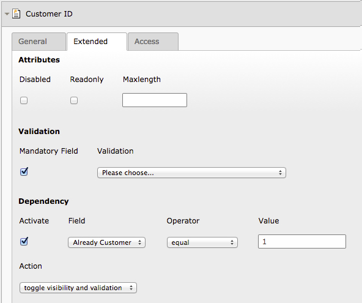

# Powermail Ext #

This Extension was developed to add some functionality powermail.


## Features ##

  - Additional HTML Tag Attributes (maxlength, disabled, readonly) for Input/Select Fields
  - Conditional Validation (and Display)
  - Viewhelper for correct Text Answer in Confirmation View for Radiobuttons and Checkboxes

## Installing ##

 - install the Extension using the Extension Manager.
 - Make sure you include the static Typoscript of this Extension in the Template right after powermail
 - Enjoy new Features!

## General ##

The Developers of Powermail developed an Extension 'powermail_cond' which should provide features like conditional Validation (and Display). Although the conditional displaying of fields in frontend worked (a little delayed, because it uses AJAX for the test), the field was still validated server-side after submission. So it was impossible to have a mandatory field which is only mandatory when a other field meets a requirement..
In my opinion - additionally - it was a little effort to create all the rule and condition records. And you don't see if a field has a condition or rule when you are editing the powermail form..

I don't want to cheapen the great 'powermail_cond' Extension, but the above reasons made me finding a simpler solution for the conditional validation. Maybe it is fixed now.

Powermailext requires jQuery Library to be included in the frontend.

Powermailext provides fluid Templates for some partials of powermail, if you want to use this functionality in your own template, make sure you include the following at the top of your fluid template:
```
{namespace pmext=WorldDirect\Powermailext\ViewHelpers}
```

### Conditional Validation ###

The Main Feature of this Extension is the conditional Validation. It offers the opportunity, to only validate fields (client and server side) if a other field meets a specific requirement.

In Backend, you can define your validation condition for a powermail field. After activating the conditional validation, three new fields appear:
  - Field (the field from which the current depends on)
  - Operator (the operator which will be used for comparison)
  - Value (the value which will be compared with the field value of 'Field')


#### Example ####

For example, you want to display the field 'customer id' only if the user checks the box 'I am already customer', and display different further options when checked a specific radio button.

To achieve the above example, you need the following fields in your form
  * Checkboxes (I am already customer)
  * Input (Customer ID)
  * Radio (Choose Brand)
  * Checkboxes (Audi)
  * Checkboxes (BMW)

This will generate a form like this in the Frontend (unstyled)


Add a Label and a value (the use of integer 1 as checkbox value for enabling/disabling checkbox has proven to be..) to the checkbox and activate the conditional validation of the input field.
Select the checkbox in the select box, use 'equal' as operator and insert '1' as value.




Add the values '1' and '2' to the Radio Buttons 'Choose Brand'.
Also activate the validation condition for both checkboxes fields (Audi and BMW) and configure them like the checkbox above, use '1' as comparison value at Audi Checkboxes and '2' at BMW.
When you check your form in the frontend, you will notice that the 'Customer ID' input and 'Audi'/'BMW' checkboxes are hidden if the specific checkbox/radio is not checked. Check the checkbox to toggle the visibility of the input field. In this Screenshot also the option for the choosing of car models depends on the selection of the brand.


### Additional Attributes ###

Sometimes, you need to mark input fields with attributes like "readonly", "disabled" or specify the "maxlength" Attribute. With this Extension installed, the Powermail Record got a new section "Attributes" in the tag "Extended"
Here you can activate the desired Attributes.


There is a View Helper which extends the 'ValidationDataAttribute' View Helper called 'ValidationDataAndAttributes' View Helper. Make sure you use this View Helper instead of the Powermail's View Helper:

Partials/Form/FIELDNAME.html
```
additionalAttributes="{pmext:Validation.ValidationDataAndAttributes(field:field, iteration:index)}
````

### Correct Text Answers ###

Powermail does offer the opportunity to add different values and labels to radiobuttons and checkboxes. In confirmation View, you only see the value. Sometimes you specify values like integers ore single characters as a value for a checkbox, because your label includes some special chars or is too long. These values are much better for further processing, but in confirmation view the user sees them instead of the labels. Powermailext provides a View Helper for this. A few lines of code will change the functionality:

Partials/PowermailAll/Web.html
```
<pmext:Misc.CorrectTextAnswer answer="{answer}" />
```
instead of
```
<f:if condition="{vh:Condition.IsArray(val: '{answer.value}')}">
	<f:else>
		<f:format.nl2br>{answer.value}</f:format.nl2br>
	</f:else>
	<f:then>
		<f:for each="{answer.value}" as="subValue" iteration="index">
			<f:if condition="{subValue}">
				{subValue}<f:if condition="{index.isLast}"><f:else>, </f:else></f:if>
			</f:if>
		</f:for>
	</f:then>
</f:if>
```

This View Helper also takes care of array handling and nested Answers.
